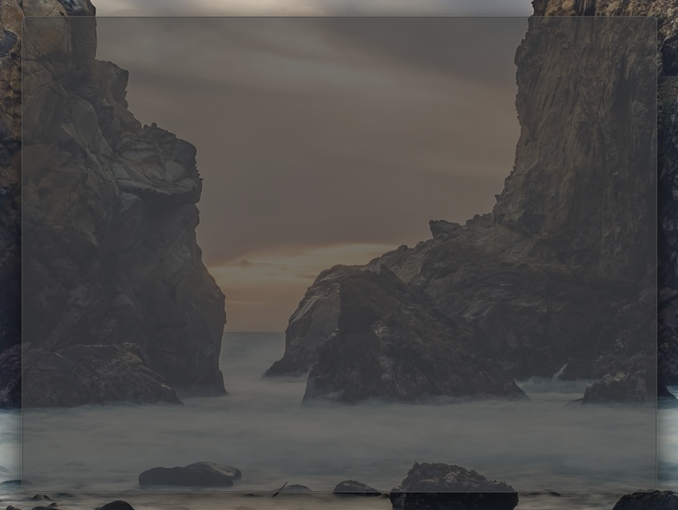
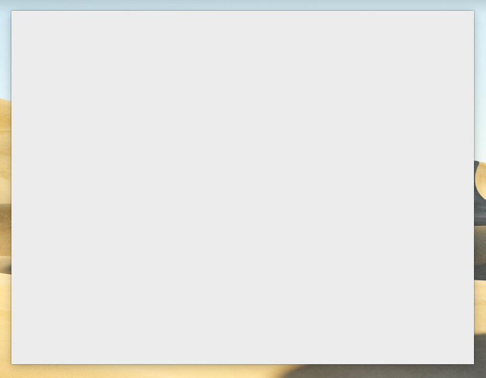

> [!warning]
>
> # ARCHIVE NOTICE
>
> This crate is **Unmaintained**! it served its purpose which was an interim
> solution to enable shadows on undecorated windows for `tao` and `tauri`.
>
> As of `tauri@v2` and recent versions of `tao` and `winit`, they all support
> enablind/disabling shadows so this crate is not needed.
>
> If you're using `tauri@v1` and need this crate, don't worry, this crate will
> still function with `tauri@v1` without any problems.

# window-shadows

[](https://crates.io/crates/window-shadows)
[](https://docs.rs/window-shadows/)

[](https://discord.gg/SpmNs4S)

Add native shadows to your windows.

## Platform-specific

-   **Windows**: On Windows 11, the window will also have rounded corners.
-   **macOS**: Shadows are always disabled for transparent windows.
-   **Linux**: Unsupported, Shadows are controlled by the compositor installed
    on the end-user system.

## Example

```rs
use window_shadows::set_shadow;

#[cfg(any(windows, target_os = "macos"))]
set_shadow(&window, true).unwrap();
```

## Screenshots

<p align="center">

|                     Windows                      |                    macOS                     |
| :----------------------------------------------: | :------------------------------------------: |
|  |  |

</p>
